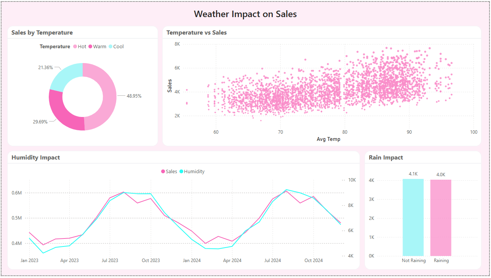

# 🏝️ Miami Retail Analytics Dashboard

**Miami Retail Analytics Dashboard** – A data analytics project that analyzes multi-store retail performance by integrating sales, customer demographics, and weather data. The project includes SQL data modeling, feature engineering, and an interactive BI dashboard to uncover performance drivers and customer behavior insights.

---

## 📌 Project Overview

This project explores retail performance across multiple Miami-based shops by combining:

- 🛒 Sales transactions  
- 👥 Customer demographic survey data  
- 🌦️ Weather conditions  

### 🎯 Objectives

- Analyze overall sales performance  
- Understand customer behavior patterns  
- Compare shop-level performance  
- Evaluate weekend vs weekday impact  
- Assess whether weather conditions influence revenue  

---

## 🛠️ Tech Stack

- **SQL (MySQL)** – Data cleaning, joins, feature engineering, view creation  
- **Power BI** – Interactive dashboard development    
- **Analytics Techniques**
  - Sales per customer metric  
  - Weekend vs weekday segmentation  
  - Time-series trend analysis  
  - External factor impact analysis (weather correlation)  

---

## 🗂️ Data Model

The database consists of three main tables:

- `sales` – Daily shop-level sales and customer counts  
- `survey` – Customer demographic distribution (male, female, family, single)  
- `weather` – Daily temperature, precipitation, humidity, rain indicator

### 🔧 Engineered Features

- `sales_per_customer`
- `day_of_week`
- `is_weekend`
- Weather indicators integration

---

## 📊 Dashboard Structure

### 🟣 Page 1 – Sales Performance & Customer Behavior

**Business Question:**  
How is overall performance evolving and what customer behaviors drive revenue?

#### Key Insights Delivered

- 💰 Total Sales & Average Daily Sales  
- 👥 Customer volume tracking  
- 📈 Sales trend over time  
- 🏬 Sales comparison by shop  
- 📊 Customer composition breakdown  
- 📅 Weekend vs Weekday performance  

---

### 🟢 Page 2 – Weather Impact Analysis

**Business Question:**  
Do external weather conditions affect retail performance?

#### Analysis Includes

- 🌧️ Sales on Rainy vs Non-Rainy days  
- 🌡️ Temperature vs Sales relationship  
- 💧 Humidity impact on customer traffic  
- 📉 Precipitation trend over time  

This page introduces external-factor modeling beyond traditional BI dashboards.

---

## 📈 Key Metrics Created

- Sales Per Customer  
- Average Daily Sales  
- Weekend Sales Uplift  
- Shop Revenue Contribution  
- Customer Segment Distribution  
- Weather Impact Comparison  

---

## 💡 Key Findings

- Weekend sales outperform weekdays.  
- Certain shops consistently drive higher revenue share.  
- Customer composition remains relatively balanced across segments.  
- Weather conditions show measurable impact on daily sales fluctuations.  

---

## 🎯 Business Value

This dashboard enables stakeholders to:

- Optimize marketing timing (weekend focus)  
- Identify top-performing shops  
- Understand customer segment contribution  
- Anticipate performance fluctuations based on weather  
- Make data-driven operational decisions  

---

## 📷 Dashboard Preview
### 🟣 Page 1 – Sales Performance

### 🟢 Page 2 – Weather Impact

---

## 🚀 How to Reproduce

1. Import the dataset into MySQL  
2. Execute the SQL scripts in `/sql`  
3. Create the analytical view  
4. Connect Power BI / Tableau to the database  
5. Load the dashboard file  

---

## 👤 Author

**Marwan Aly**  
Aspiring Data Scientist / AI Engineer  
Focused on analytics, data modeling, and applied machine learning.
